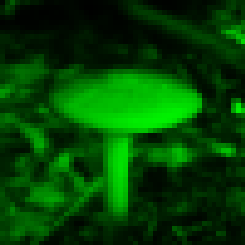
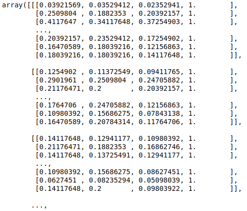
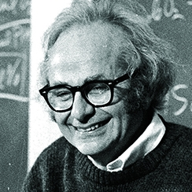
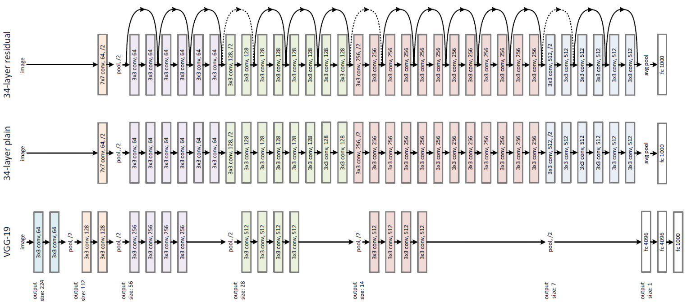

class: middle, center, title-slide
count: false

# Intelligence artificielle

Cycle de conférences .italic["De l'homme préhistorique à l'homme robotique"].

21 mars 2019

  
Prof. Gilles Louppe 
[g.louppe@uliege.be](g.louppe@uliege.be)

---

# Sommaire

- Qu'est-ce que l'intelligence artificielle?
- Réseaux de neurones et apprentissage profond
- Que peut faire une IA aujourd'hui?
- Limites et défis

---

class: middle

# Qu'est-ce que l'intelligence artificielle?

---

class: middle, center

.width-70[]

"With artificial intelligence we are summoning the demon" -- Elon Musk

???

Vision alarmiste de l'IA dans l'actualité.

Imaginaire de science-fiction alimenté par le cinéma.

---

class: middle, center

.width-60[]

"We're really closer to a smart washing machine than Terminator" -- Fei-Fei Li, Director of Stanford AI Lab.

---

class: middle

.width-60.center[]

## The Darthmouth workshop (1956)

.italic[The study is to proceed on the basis of the conjecture that every aspect of learning or any other feature of intelligence can in principle be *so precisely described* that a machine can be made to simulate it.]

???

L'intelligence artificielle n'est pas une discipline ancienne, mais ce n'est pas non plus un domain scientifique tout à fait nouveau.

L'invention du terme IA remonte aux années 1950.

But affirmé et ambitieux.

---

class: middle, center, black-slide

<iframe width="600" height="450" src="https://www.youtube.com/embed/aygSMgK3BEM" frameborder="0" allowfullscreen></iframe>

???

Enthousiasme jusqu'au début des années 1970.

---

class: middle

.center[

.width-30.circle[]&nbsp;&nbsp;&nbsp;
.width-30.circle[]

]

Edsger Dijkstra: .italic[What do you work on?] 
Leslie Valiant (very proudly): .italic[AI.] 
Edsger Dijkstra: .italic[Why don't you work first on the .bold["Intelligence"] part?]

???

-> On évacue le terme 'artificielle'

---

class: middle

.width-30.circle.center[]

.italic[".bold[What is intelligence, anyway?] It is only a word that people use to name those unknown processes with which our brains
solve problems we call hard. But whenever you learn a skill yourself, you're less impressed or mystified when other people
do the same.

This is why .bold[the meaning of "intelligence" seems so elusive]: it describes not some definite thing but only the
momentary horizon of .bold[our ignorance about how minds might work]. It is hard for scientists who try to understand intelligence
to explain precisely what they do, since our working definitions change from year to year. But it is not at all unusual for
sciences to aim at moving targets." -- Marvin Minsky]

???

-> On évacue le terme 'intelligence'

---

class: middle

.grid[
.kol-1-3[ .width-100[]]
.kol-2-3[.width-100[]]
]

???

No unified theory, no consensus.

Hence different approaches towards AI, from many different disciplines.

---

class: middle

# Réseaux de neurones et apprentissage profond

???

Plusieurs approches vers l'IA.

Aujourd'hui nous allons couvrir l'une d'entre elles dans le but de construire un programme qui serait capable de voir.

Les réseaux de neurones artificiels et l'apprentissage profond sont à l'origine de la majorité des derniers succès dont vous avez peut-etre entendu parler dans l'actualité.

---

class: middle, center

.width-80[]

Que voyez-vous?

???

Comment faites-vous cela ?!

---

class: middle

.center[
.width-70[]

Sheepdog ou mop?
]

.footnote[Credits: [Karen Zack](https://twitter.com/teenybiscuit), 2016.]

---

class: middle

.center[
.width-70[]

Chihuahua ou muffin?
]

.footnote[Credits: [Karen Zack](https://twitter.com/teenybiscuit). 2016.]

---

class: middle

L'extraction automatique d'une interprétation **sémantique** à partir d'un signal brut est au coeur de nombreuses applications, telles que
- la reconnaissance d'images
- l'interprétation de la voix
- la compréhension des langages naturels  
- le controle robotique
- ... et bien dautres.

Comment pourrions-nous *écrire un programme* qui implémente une telle fonctionalité?

???

Exemples:
- reconnaissance -> appareil photo focus automatique

---

class: middle

Le cerveau humain est tellement efficace dans l'interprétation d'informations visuelles qu'il est difficile d'évaluer intuitivement la différence entre un signal brut et son interprétation sémantique:

 
.center[

Ceci est un champignon.
]

---

class: middle, center

.width-70[]

Ceci est un champignon.

---

class: middle, center

.width-30[] +
.width-30[] +
.width-30[]

Ceci est un champignon.

---

class: middle, center

.width-80[]

Ceci est un champignon.

---

class: middle

Extraire la sémantique d'une image requiert un modèle de **haute complexité**, qui ne peut être construit à la main.

Cependant, il est possible d'écrire un programme qui *apprend* cette tâche.

Les techniques habituellement utilisées consistent:
- à définir un modèle paramétrique de haute capacité,
- à en optimiser les paramètres, jusqu'à le faire fonctionner correctement sur des données d'entraînement.

---

# Machines that see

.grid.center[
.kol-1-10[]
.kol-3-5.center[ .width-80[]]
.kol-1-5[.width-100.circle[].width-100.circle[]]
]
 

## Perception visuelle (Hubel et Wiesel, 1959-1962)

- David Hubel et Torsten Wiesel découvrent la base neuronale responsable de la *perception visuelle* chez le chat.
- Prix Nobel de médecine en 1981.

---

class: middle, black-slide

.center[

<iframe width="640" height="480" src="https://www.youtube.com/embed/y_l4kQ5wjiw?&loop=1&start=0" frameborder="0" volume="0" allowfullscreen></iframe>

]

.center[Hubel and Wiesel]

???

During their recordings, they noticed a few interesting things:
1. the neurons fired only when the line was in a particular place on the retina,
2. the activity of these neurons changed depending on the orientation of the line, and
3. sometimes the neurons fired only when the line was moving in a particular direction.

---

class: middle

.width-90.center[]

.footnote[Credits: Hubel and Wiesel, [Receptive fields, binocular interaction and functional architecture in the cat's visual cortex](https://www.ncbi.nlm.nih.gov/pmc/articles/PMC1359523/), 1962.]

---

class: middle

.width-90.center[]

.footnote[Credits: Hubel and Wiesel, [Receptive fields, binocular interaction and functional architecture in the cat's visual cortex](https://www.ncbi.nlm.nih.gov/pmc/articles/PMC1359523/), 1962.]

---

class: middle

.grid[
.kol-2-3[.center.width-100[]]
.kol-1-3[     $$h = \sigma \left(\sum w\_i x\_i \right)$$]
]

## Perceptron (Rosenblatt, 1959)

- Implémentation d'un réseau de neurones sur un circuit analogique.
- Paramètres ajustables par des potentimètres.

.footnote[Credits: Frank Rosenblatt, [Mark I Perceptron operators' manual](https://apps.dtic.mil/dtic/tr/fulltext/u2/236965.pdf), 1960.]

---

class: middle, center, black-slide

.grid[
.kol-1-2[.width-100[]]
.kol-1-2[  .width-100[]]
]

The Mark I Percetron (Frank Rosenblatt).

---

class: middle

.center.width-60[]

.italic["If we show the perceptron a stimulus, say a square, and associate a response to that square, this response will immediately *generalize perfectly to all
transforms* of the square under the transformation group [...]."]

Similaire aux cellules simples et complexes identifiées par Hubel et Wiesel!

.footnote[Credits: Frank Rosenblatt, [Principle of Neurodynamics](http://www.dtic.mil/dtic/tr/fulltext/u2/256582.pdf), 1961.]

???

Premier niveau = detection du pattern à une position x

Deuxième niveau = detection de la présence du pattern dans le champ récepteur, peu important sa position x.

---

class: middle

.grid[
.kol-3-4[

## Impossibilité (Minsky and Papert, 1969+)

- Minsky and Papert redéfinissent le perceptron comme un classifieur linéaire.
- Ils démontrent une série de résultats d'impossibilité pour le perceptron.

]
.kol-1-4[.width-100[]]
]

---

class: middle

## Neocognitron (Fukushima, 1980)

.center.width-90[]

Fukushima propose une implémentation par **réseau de neurones artificiels** du modèle hierarchique du système perceptuel de Hubel and Wiesel.

.footnote[Credits: Kunihiko Fukushima, [Neocognitron: A Self-organizing Neural Network Model](https://www.rctn.org/bruno/public/papers/Fukushima1980.pdf), 1980.]

???

Les patterns à détecter sont appris, et non hardcodés comme pour le perceptron.

---

class: middle

.center.width-90[]

---

class: middle, black-slide

## AI winter (1969-1985)

La recherche fondamentale en réseaux de neurones artificiels stagne pendant plusieurs années, au point de presque disparaître.

---

class: middle

.center.width-90[]

## Inspiration biologique?

- Clément Ader **calque** la construction de l'Eole sur l'anatomie des chauve-souris.
- Elle s'envola le 9 octobre 1890 (13 années avant les frères Wright).
- ... mais vous n'en avez certainement jamais entendu parler!

---

class: middle

.grid[
.kol-2-5.center[.width-100[]]
.kol-3-5[

       

$$\neq \sigma \left(\sum w\_i x\_i \right)$$

]
]

---

class: middle

## Backpropagation (Rumelhart et al, 1986)

 
$$\theta\_{t+1} = \theta\_t -\gamma \nabla\_\theta \mathcal{L}(\theta\_t)$$

---

class: middle

## Réseaux de convolutions (LeCun, 1990)

- Premier réseau de convolutions entraîné par **backpropagation**.
- Aucun pré-traitement des données. L'apprentissage est totalement autonome.
- Système utilisé à grande échelle pour lire des chèques de banque.

 
.center.width-100[]

.footnote[Credits: LeCun et al, [Handwritten Digit Recognition with a Back-Propagation Network](http://yann.lecun.com/exdb/publis/pdf/lecun-90c.pdf), 1990.]

---

class: center, middle, black-slide

.width-100[]

---

# Apprentissage profond

.grid[
.kol-2-5[ .center.width-70[]]
.kol-1-10[   $$\Rightarrow$$]
.kol-1-2[.center.width-80[]]
]

Les réseaux de neurones modernes sont définis comme
un *assemblage hiérarchique* d'opérations mathématiques **élémentaires**.

---

class: middle

.center.width-100[]

---

class: middle

.center.width-70[]
.center.width-90[]

.center[Des réseaux de plus en plus *profonds* et complexes  permettent d'atteindre un niveau de performance **super-humain**.]

.footnote[Credits: Canziani et al, [An Analysis of Deep Neural Network Models for Practical Applications](https://arxiv.org/abs/1605.07678), 2016.]

---

class: middle, black-slide

.center.width-60[]

.center[La flexibilité des architectures des réseaux profonds  permet de résoure de nombreuses tâches.]

---

class: middle

# Que peut faire une IA aujourd'hui?

---

class: middle

- Faire une traduction instantanée du Chinois vers l'Anglais?
- Répondre à un QCM, aussi bien qu'un enfant de 8 ans?
- Avoir une conversation pendant une heure?
- Jouer aux échecs? au jeu de Go? au Poker? au football?
- Faire les course, sur le web? dans un supermarché?
- Démontrer des théorèmes?
- Conduire une voiture, sur un parking? sur l'autoroute? dans le centre de Liège?
- Accomplir des actes chirurgicaux?
- Identifier des mélanomes, mieux que votre dermatologue?
- Ecrire une blague?
- Peindre comme Van Gogh? Composer une musique?

---

class: middle, center, black-slide

<iframe width="600" height="450" src="https://www.youtube.com/embed/qWl9idsCuLQ" frameborder="0" allowfullscreen></iframe>

Segmentation (Hengshuang et al, 2017)

---

class: middle, center, black-slide

<iframe width="600" height="450" src="https://www.youtube.com/embed/pW6nZXeWlGM" frameborder="0" allowfullscreen></iframe>

Pose estimation (Cao et al, 2017)

---

class: middle, center, black-slide

<iframe width="600" height="450" src="https://www.youtube.com/embed/-96BEoXJMs0" frameborder="0" allowfullscreen></iframe>

Driving a car (2016)

---

class: middle, center, black-slide

<iframe width="600" height="450" src="https://www.youtube.com/embed/yyLa6xIK9Qs" frameborder="0" allowfullscreen></iframe>

Playing soccer (2018)

---

class: middle, center, black-slide

<iframe width="600" height="450" src="https://www.youtube.com/embed/V1eYniJ0Rnk" frameborder="0" allowfullscreen></iframe>

Playing Atari games

---

class: middle, center, black-slide

<iframe width="600" height="450" src="https://www.youtube.com/embed/gn4nRCC9TwQ" frameborder="0" allowfullscreen></iframe>

Learning to walk (2017)

---

class: middle, center, black-slide

<iframe width="600" height="450" src="https://www.youtube.com/embed/7gh6_U7Nfjs" frameborder="0" allowfullscreen></iframe>

Speech synthesis and question answering (Google, 2018)

---

class: middle, center, black-slide

<iframe width="600" height="450" src="https://www.youtube.com/embed/kSLJriaOumA" frameborder="0" allowfullscreen></iframe>

Image generation (Karras et al, 2018)

---

class: middle, center, black-slide

<iframe width="600" height="450" src="https://www.youtube.com/embed/p5U4NgVGAwg" frameborder="0" allowfullscreen></iframe>

Changing sketches into photorealistic masterpieces (NVIDIA)

---

class: middle, center, black-slide

<iframe width="600" height="450" src="https://www.youtube.com/embed/egJ0PTKQp4U?start=223" frameborder="0" allowfullscreen></iframe>

Music composition (NVIDIA, 2017)

---

class: middle

## Pourquoi maintenant?

.center.grid[
.kol-1-2[
Meilleurs algorithmes  
.width-90[]
]
.center.kol-1-2[
Plus de données  
.width-50[]
]
]

.center.grid[
.kol-1-2[
Meilleurs logiciels 
.width-90[]
]
.kol-1-2[
Meilleures machines  
.width-50[]
]
]

---

class: middle

# Limites et défis

???

Trois grands défis pour l'IA:
- AGI
- Innéisme vs constructivisme
- Sens commun

---

class: middle

.center.width-40[]

## Intelligence artificielle étroite

- Les meilleurs programmes d'intelligence artificielle atteignent souvent un niveau de performance qui dépasse les capacités humaines.
- ... mais seulement pour des problèmes *très spécifiques*!
- Ils **ne généralisent pas** au monde réel, ni à des tâches arbitraires.

---

class: middle

## Intelligence artificielle générale

L'intelligence artificielle **générale** est l'intelligence d'une machine qui pourrait accomplir n'importe quelle tâche intellectuelle aussi bien qu'un humain.

- Pas de définition claire et précise.
- Consensus qu'une telle machine devrait être capable de:
    - raisonner, faire preuve de strategie, résoudre des puzzles, planifier,
    - faire preuve de jugement, en tenant compte des incertitudes,
    - avoir une représentation de la connaissance, en ce inclus le sens commun,
    - s'améliorer et apprendre de nouvelles choses,
    - communiquer,
    - intégrer toutes ces facultés pour la réalisation d'objectifs.

???

Créer une AGI reste une des grandes questions du domaine.

---

class: middle

## Innéisme vs. Constructivisme

.grid[
.kol-2-3[
- *Innéisme* (Noam Chomsky):
    - Postule que l'human possède une faculté innée pour la pensée et le langage et que cette faculté est programmée génétiquement.
    - Les structures de la pensée et du langage sont révélées et dévelopées par interaction avec l'environement.
- **Constructivisme** (Jean Piaget):
    - Nie l'existence de structures cognitives spécifiques à la pensée et au langage.
    - Postule que toutes les facultés cognitives sont le résultat d'un processus de construction graduel.
]
.kol-1-3[.center.width-80[]]
]

[Q] Qu'en est-il de l'IA? Devrait-elle être une machine pré-programmée? ou bien une machine qui peut apprendre et s'auto-améliorer? ou bien un peu des deux?

---

class: middle

## Sens commun

Nous construisons tous un modèle du monde par **apprentissage non-supervisé**.
- Ce modèle nous procure le *sens commun*.
- L'apprentissage non-supervisé permet de découvrir et de synthétiser les régularités du monde.

---

class: middle

Si je dis: "Benoit prend son sac et quitte la pièce:".

On en **déduit** que:
- Benoit s'est levé, a tendu son bras pour prendre son sac, a marché vers la porte, a ouvert la porte, puis est finalement sorti de la pièce.
- Benoit et son sac ne sont plus dans la pièce.
- Il ne s'est probablement pas dématérialisé ni envolé par la fenêtre.

.center.width-50[]

.footnote[Credits: Yann Lecun (NYU), [Deep Learning, 2017](https://cilvr.nyu.edu/doku.php?id=deeplearning2017:schedule)]

---

class: middle, center, black-slide

<iframe width="600" height="450" src="https://www.youtube.com/embed/cdmAEcXpZRk" frameborder="0" allowfullscreen></iframe>

Orangutan loves magic trick!

---

# Conclusions

- L'intelligence artificielle est à l'origine de nombreux progrès actuels et à venir.
- Ses domaines d'application sont nombreux et variés:
    - sciences,
    - technologies,
    - santé.
- La recherche n'est pas terminée. De nombreuses questions cherchent toujours réponse.

---

class: end-slide, center
count: false

.center.bold["What is intelligence, anyway?"]

   

Fin.
